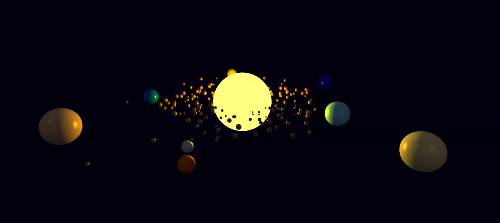

# 4D Physics Engine in Go



A physics engine written in Go capable of simulating objects in a four-dimensional space (3 spatial dimensions + time). The engine is designed to be scientifically accurate, highly abstract, and easily extensible.

## Overview

This physics engine provides a comprehensive framework for simulating physical interactions in both 3D and 4D space. It features a modular architecture with clear separation between physics logic and rendering, allowing it to be used with different graphics engines. The engine implements various optimization techniques such as spatial partitioning (octree) and multithreading to achieve high performance even with a large number of bodies.

## Key Features

- **Accurate Physics Simulation**: Implementation of real physical laws with well-defined units of measurement and precise physical constants.
- **4D Space-Time Support**: Representation and simulation of objects in 4D space (3 spatial dimensions + time), including relativistic effects.
- **Modular Architecture**: Interface-based design that allows easy extension and customization of the engine.
- **Spatial Optimization**: Use of optimized data structures (octree) to improve the performance of spatial queries.
- **Barnes-Hut Algorithm**: Optimized gravitational force calculation that reduces complexity from O(n²) to O(n log n).
- **Multithreading**: Parallel processing of force calculations, collision detection, integration, and spatial structure updates.
- **Collision Detection and Resolution**: Robust system for handling collisions between bodies.
- **Multiple Numerical Integrators**: Various numerical integration methods (Euler, Verlet, Runge-Kutta) for solving equations of motion.
- **Event System**: Mechanism for notifying events such as collisions, body additions/removals, etc.
- **Abstract Rendering Interface**: Separation between physics logic and rendering, allowing use with different graphics engines.
- **G3N Rendering Adapter**: Built-in adapter for the G3N graphics engine for visualization.

## Project Structure

```
engine/
├── core/                  # Core components
│   ├── vector/            # 3D/4D vector implementation
│   ├── units/             # Measurement units system
│   └── constants/         # Physical constants
├── physics/               # Physics engine
│   ├── body/              # Physical bodies
│   ├── force/             # Forces (gravity, etc.)
│   ├── collision/         # Collision detection and resolution
│   ├── material/          # Material properties
│   ├── space/             # Spatial structures (octree, etc.)
│   └── integrator/        # Numerical integrators
├── simulation/            # Simulation management
│   ├── world/             # Simulation world
│   ├── config/            # Configuration
│   └── events/            # Event system
├── render/                # Rendering interfaces
│   ├── adapter/           # Generic adapter interface
│   └── g3n/               # G3N graphics engine adapter
├── examples/              # Usage examples
└── tests/                 # Tests
```

## Installation

```bash
# Clone the repository
git clone https://github.com/alexanderi96/go-space-engine.git

# Enter the project directory
cd go-space-engine

# Install dependencies
go get -u ./...
```

## Basic Usage

Here's a simple example of how to use the physics engine for a basic simulation:

```go
// Create a simulation configuration
cfg := config.NewSimulationBuilder().
    WithTimeStep(0.01).
    WithGravity(true).
    WithCollisions(true).
    WithWorldBounds(
        vector.NewVector3(-10, -10, -10),
        vector.NewVector3(10, 10, 10),
    ).
    Build()

// Create the simulation world
w := world.NewPhysicalWorld(cfg.GetWorldBounds())

// Add gravitational force
gravityForce := force.NewGravitationalForce()
w.AddForce(gravityForce)

// Create and add bodies
// ...

// Run the simulation
for i := 0; i < 100; i++ {
    w.Step(cfg.TimeStep)
}
```

## Optimization Techniques

### Barnes-Hut Algorithm

The engine implements the Barnes-Hut algorithm for gravitational force calculation, which reduces the computational complexity from O(n²) to O(n log n). This is achieved by approximating the gravitational effect of a group of distant bodies as a single body at their center of mass.

The algorithm works by:
1. Dividing the space into an octree structure
2. Calculating the center of mass for each node in the octree
3. Using the center of mass to approximate the gravitational force for distant bodies

### Multithreading

The engine makes extensive use of multithreading to parallelize computationally intensive operations:

- Force calculations
- Collision detection and resolution
- Integration of equations of motion
- Spatial structure updates

A worker pool is used to manage goroutines efficiently, adapting to the available CPU cores.

## Visualization with G3N

The engine includes an adapter for the G3N graphics engine, allowing for real-time visualization of simulations:

```go
// Create G3N adapter
adapter := g3n.NewG3NAdapter()

// Configure the adapter
adapter.SetBackgroundColor(g3n.NewColor(0.0, 0.0, 0.1, 1.0))

// Run the rendering loop
adapter.Run(func(deltaTime time.Duration) {
    // Update simulation
    w.Step(0.01)
    
    // Render the world
    adapter.RenderWorld(w)
})
```

## Examples

The `examples/` directory contains several examples demonstrating different aspects of the engine:

- `simple_simulation.go`: A basic simulation with gravity and collisions
- `g3n/solar_system/main.go`: A solar system simulation with planets in orbit
- `g3n/3_body_problem/main.go`: Simulation of the three-body problem
- `g3n/cube/main.go`: A simple cube simulation

## Extending the Engine

The engine is designed to be easily extensible through its interface-based architecture. You can extend it by:

1. Implementing new force types by implementing the `Force` interface
2. Creating custom body types by extending the `RigidBody` struct
3. Implementing new integrators by implementing the `Integrator` interface
4. Creating custom collision detectors and resolvers
5. Implementing adapters for different rendering engines

## Future Development

Planned future enhancements include:

1. General relativity effects
2. Exotic space-time structures (wormholes, black holes)
3. Advanced visualization of relativistic effects
4. Quantum effects at small scales
5. Further performance optimizations

## License

This project is distributed under the MIT License.