# Piano di Ottimizzazione del Multithreading

Questo documento descrive in dettaglio le modifiche necessarie per estendere l'uso del multithreading nel motore fisico, parallelizzando tutte le operazioni che potrebbero beneficiarne.

## Analisi dell'implementazione attuale del multithreading

Attualmente, il multithreading è implementato attraverso un `WorkerPool` che gestisce un pool di goroutine per eseguire task in parallelo. Il pool viene inizializzato con un numero di worker pari al numero di CPU disponibili.

Le operazioni già parallelizzate sono:

1. **Calcolo delle forze gravitazionali** utilizzando l'algoritmo Barnes-Hut con l'octree
2. **Applicazione di altre forze globali**
3. **Applicazione di forze tra coppie di corpi**
4. **Rilevamento e risoluzione delle collisioni**

## Operazioni che potrebbero beneficiare della parallelizzazione

Basandomi sull'analisi del codice, ho identificato le seguenti operazioni che potrebbero beneficiare della parallelizzazione:

1. **Integrazione delle equazioni del moto**: Attualmente, il metodo `IntegrateAll` in tutti gli integratori itera sequenzialmente su tutti i corpi. Poiché l'integrazione di ciascun corpo è indipendente dalle altre, questa operazione è un candidato ideale per la parallelizzazione.

2. **Aggiornamento della struttura spaziale**: Il metodo `updateSpatialStructure` in `world.go` aggiorna sequenzialmente la posizione di tutti i corpi nella struttura spaziale. Anche questa operazione potrebbe essere parallelizzata.

3. **Gestione delle collisioni con i limiti del mondo**: Il metodo `handleBoundaryCollisions` viene chiamato per ogni corpo all'interno del metodo `handleCollisions`, ma potrebbe essere ottimizzato per una migliore gestione parallela.

## Piano di implementazione

### 1. Parallelizzazione dell'Integrazione delle Equazioni del Moto

#### Modifiche a `physics/integrator/integrator.go`

Modificheremo l'interfaccia `Integrator` per aggiungere un metodo che accetta un `WorkerPool`:

```go
// Integrator rappresenta un integratore numerico per le equazioni del moto
type Integrator interface {
    // Integrate integra le equazioni del moto per un corpo
    Integrate(b body.Body, dt float64)
    // IntegrateAll integra le equazioni del moto per tutti i corpi
    IntegrateAll(bodies []body.Body, dt float64)
    // IntegrateAllParallel integra le equazioni del moto per tutti i corpi in parallelo
    IntegrateAllParallel(bodies []body.Body, dt float64, workerPool *world.WorkerPool)
}
```

Implementeremo questo metodo per ciascun integratore. Ecco l'implementazione per l'integratore di Verlet:

```go
// IntegrateAllParallel integra le equazioni del moto per tutti i corpi in parallelo
func (vi *VerletIntegrator) IntegrateAllParallel(bodies []body.Body, dt float64, workerPool *world.WorkerPool) {
    for _, b := range bodies {
        b := b // Cattura la variabile per la goroutine
        workerPool.Submit(func() {
            vi.Integrate(b, dt)
        })
    }
    workerPool.Wait()
}
```

Implementazioni simili saranno create per gli integratori `EulerIntegrator` e `RK4Integrator`.

#### Modifiche a `simulation/world/world.go`

Modificheremo il metodo `Step` per utilizzare l'integrazione parallela:

```go
// Step avanza la simulazione di un passo temporale
func (w *PhysicalWorld) Step(dt float64) {
    // Applica le forze
    w.applyForces()

    // Rileva e risolvi le collisioni
    w.handleCollisions()

    // Integra le equazioni del moto in parallelo
    bodies := w.GetBodies()
    if integrator, ok := w.integrator.(interface {
        IntegrateAllParallel(bodies []body.Body, dt float64, workerPool *WorkerPool)
    }); ok {
        integrator.IntegrateAllParallel(bodies, dt, w.workerPool)
    } else {
        // Fallback all'implementazione sequenziale
        w.integrator.IntegrateAll(bodies, dt)
    }

    // Aggiorna la struttura spaziale
    w.updateSpatialStructure()
}
```

### 2. Parallelizzazione dell'Aggiornamento della Struttura Spaziale

#### Modifiche a `simulation/world/world.go`

Modificheremo il metodo `updateSpatialStructure` per utilizzare il multithreading:

```go
// updateSpatialStructure aggiorna la struttura spaziale
func (w *PhysicalWorld) updateSpatialStructure() {
    for _, b := range w.bodies {
        b := b // Cattura la variabile per la goroutine
        w.workerPool.Submit(func() {
            w.spatialStructure.Update(b)
        })
    }
    w.workerPool.Wait()
}
```

### 3. Ottimizzazione della Gestione delle Collisioni con i Limiti del Mondo

#### Modifiche a `simulation/world/world.go`

Modificheremo il metodo `handleBoundaryCollisions` per gestire meglio la sincronizzazione:

```go
// handleBoundaryCollisions gestisce le collisioni con i limiti del mondo
func (w *PhysicalWorld) handleBoundaryCollisions(b body.Body) {
    // Se il corpo è statico, non fare nulla
    if b.IsStatic() {
        return
    }

    // Ottieni i dati del corpo una sola volta per ridurre le chiamate di metodo
    position := b.Position()
    velocity := b.Velocity()
    radius := b.Radius().Value()
    bounds := w.bounds
    elasticity := b.Material().Elasticity()

    // Flag per tracciare se la posizione o la velocità sono state modificate
    positionChanged := false
    velocityChanged := false
    newPosition := position
    newVelocity := velocity

    // Collisione con il limite inferiore X
    if position.X()-radius < bounds.Min.X() {
        // Correggi la posizione
        newPosition = vector.NewVector3(bounds.Min.X()+radius, position.Y(), position.Z())
        positionChanged = true

        // Inverti la velocità X con smorzamento
        newVelocity = vector.NewVector3(-velocity.X()*elasticity, velocity.Y(), velocity.Z())
        velocityChanged = true
    }

    // Collisione con il limite superiore X
    if position.X()+radius > bounds.Max.X() {
        // Correggi la posizione
        newPosition = vector.NewVector3(bounds.Max.X()-radius, position.Y(), position.Z())
        positionChanged = true

        // Inverti la velocità X con smorzamento
        newVelocity = vector.NewVector3(-velocity.X()*elasticity, velocity.Y(), velocity.Z())
        velocityChanged = true
    }

    // Collisione con il limite inferiore Y
    if position.Y()-radius < bounds.Min.Y() {
        // Correggi la posizione
        newPosition = vector.NewVector3(newPosition.X(), bounds.Min.Y()+radius, position.Z())
        positionChanged = true

        // Inverti la velocità Y con smorzamento
        newVelocity = vector.NewVector3(newVelocity.X(), -velocity.Y()*elasticity, velocity.Z())
        velocityChanged = true
    }

    // Collisione con il limite superiore Y
    if position.Y()+radius > bounds.Max.Y() {
        // Correggi la posizione
        newPosition = vector.NewVector3(newPosition.X(), bounds.Max.Y()-radius, position.Z())
        positionChanged = true

        // Inverti la velocità Y con smorzamento
        newVelocity = vector.NewVector3(newVelocity.X(), -velocity.Y()*elasticity, velocity.Z())
        velocityChanged = true
    }

    // Collisione con il limite inferiore Z
    if position.Z()-radius < bounds.Min.Z() {
        // Correggi la posizione
        newPosition = vector.NewVector3(newPosition.X(), newPosition.Y(), bounds.Min.Z()+radius)
        positionChanged = true

        // Inverti la velocità Z con smorzamento
        newVelocity = vector.NewVector3(newVelocity.X(), newVelocity.Y(), -velocity.Z()*elasticity)
        velocityChanged = true
    }

    // Collisione con il limite superiore Z
    if position.Z()+radius > bounds.Max.Z() {
        // Correggi la posizione
        newPosition = vector.NewVector3(newPosition.X(), newPosition.Y(), bounds.Max.Z()-radius)
        positionChanged = true

        // Inverti la velocità Z con smorzamento
        newVelocity = vector.NewVector3(newVelocity.X(), newVelocity.Y(), -velocity.Z()*elasticity)
        velocityChanged = true
    }

    // Aggiorna la posizione e la velocità solo se necessario
    if positionChanged {
        b.SetPosition(newPosition)
    }
    if velocityChanged {
        b.SetVelocity(newVelocity)
    }
}
```

### 4. Ottimizzazione del WorkerPool

Per migliorare ulteriormente le prestazioni, possiamo ottimizzare il `WorkerPool` per gestire meglio il bilanciamento del carico.

#### Modifiche a `simulation/world/world.go`

```go
// WorkerPool rappresenta un pool di worker per il calcolo parallelo
type WorkerPool struct {
    numWorkers int
    tasks      chan func()
    wg         sync.WaitGroup
    mutex      sync.Mutex
    active     bool
}

// NewWorkerPool crea un nuovo pool di worker
func NewWorkerPool(numWorkers int) *WorkerPool {
    pool := &WorkerPool{
        numWorkers: numWorkers,
        tasks:      make(chan func(), numWorkers*10), // Buffer per le task
        active:     true,
    }

    // Avvia i worker
    for i := 0; i < numWorkers; i++ {
        go pool.worker()
    }

    return pool
}

// worker esegue le task dal canale
func (wp *WorkerPool) worker() {
    for task := range wp.tasks {
        task()
        wp.wg.Done()
    }
}

// Submit invia una task al pool
func (wp *WorkerPool) Submit(task func()) {
    wp.mutex.Lock()
    if !wp.active {
        wp.mutex.Unlock()
        return
    }
    wp.wg.Add(1)
    wp.mutex.Unlock()
    wp.tasks <- task
}

// Wait attende che tutte le task siano completate
func (wp *WorkerPool) Wait() {
    wp.wg.Wait()
}

// Close chiude il pool di worker
func (wp *WorkerPool) Close() {
    wp.mutex.Lock()
    defer wp.mutex.Unlock()
    if !wp.active {
        return
    }
    wp.active = false
    close(wp.tasks)
}
```

### 5. Implementazione di un Meccanismo di Bilanciamento del Carico

Per ottimizzare ulteriormente le prestazioni, possiamo implementare un meccanismo di bilanciamento del carico che adatta il numero di worker in base al carico di lavoro.

#### Modifiche a `simulation/world/world.go`

```go
// AdaptiveWorkerPool rappresenta un pool di worker che si adatta al carico di lavoro
type AdaptiveWorkerPool struct {
    WorkerPool
    minWorkers  int
    maxWorkers  int
    taskCounter int64
    lastAdapt   time.Time
}

// NewAdaptiveWorkerPool crea un nuovo pool di worker adattivo
func NewAdaptiveWorkerPool(minWorkers, maxWorkers int) *AdaptiveWorkerPool {
    pool := &AdaptiveWorkerPool{
        WorkerPool: WorkerPool{
            numWorkers: minWorkers,
            tasks:      make(chan func(), maxWorkers*10), // Buffer per le task
            active:     true,
        },
        minWorkers: minWorkers,
        maxWorkers: maxWorkers,
        lastAdapt:  time.Now(),
    }

    // Avvia i worker iniziali
    for i := 0; i < minWorkers; i++ {
        go pool.worker()
    }

    // Avvia il goroutine di adattamento
    go pool.adaptWorkers()

    return pool
}

// Submit invia una task al pool e incrementa il contatore
func (awp *AdaptiveWorkerPool) Submit(task func()) {
    awp.mutex.Lock()
    if !awp.active {
        awp.mutex.Unlock()
        return
    }
    awp.wg.Add(1)
    atomic.AddInt64(&awp.taskCounter, 1)
    awp.mutex.Unlock()
    awp.tasks <- task
}

// adaptWorkers adatta il numero di worker in base al carico di lavoro
func (awp *AdaptiveWorkerPool) adaptWorkers() {
    ticker := time.NewTicker(1 * time.Second)
    defer ticker.Stop()

    for range ticker.C {
        awp.mutex.Lock()
        if !awp.active {
            awp.mutex.Unlock()
            return
        }

        // Calcola il tasso di task per secondo
        now := time.Now()
        elapsed := now.Sub(awp.lastAdapt).Seconds()
        taskCount := atomic.SwapInt64(&awp.taskCounter, 0)
        taskRate := float64(taskCount) / elapsed

        // Adatta il numero di worker
        targetWorkers := int(math.Ceil(taskRate / 100)) // Assume 100 task/sec per worker
        targetWorkers = max(awp.minWorkers, min(targetWorkers, awp.maxWorkers))

        // Aggiungi o rimuovi worker
        if targetWorkers > awp.numWorkers {
            // Aggiungi worker
            for i := 0; i < targetWorkers-awp.numWorkers; i++ {
                go awp.worker()
            }
        }
        // Nota: non rimuoviamo worker attivamente, lasciamo che terminino naturalmente

        awp.numWorkers = targetWorkers
        awp.lastAdapt = now
        awp.mutex.Unlock()
    }
}
```

### 6. Modifiche alla Classe PhysicalWorld

Infine, modificheremo la classe `PhysicalWorld` per utilizzare il pool di worker adattivo:

```go
// PhysicalWorld implementa l'interfaccia World
type PhysicalWorld struct {
    bodies            map[uuid.UUID]body.Body
    forces            []force.Force
    integrator        integrator.Integrator
    collider          collision.Collider
    collisionResolver collision.CollisionResolver
    spatialStructure  space.SpatialStructure
    bounds            *space.AABB
    workerPool        *AdaptiveWorkerPool
}

// NewPhysicalWorld crea un nuovo mondo fisico
func NewPhysicalWorld(bounds *space.AABB) *PhysicalWorld {
    // Crea una struttura spaziale (octree) con limiti predefiniti
    spatialStructure := space.NewOctree(bounds, 10, 8)

    // Crea un pool di worker adattivo
    minWorkers := runtime.NumCPU() / 2
    maxWorkers := runtime.NumCPU() * 2
    workerPool := NewAdaptiveWorkerPool(minWorkers, maxWorkers)

    return &PhysicalWorld{
        bodies:            make(map[uuid.UUID]body.Body),
        forces:            make([]force.Force, 0),
        integrator:        integrator.NewVerletIntegrator(),
        collider:          collision.NewSphereCollider(),
        collisionResolver: collision.NewImpulseResolver(0.5),
        spatialStructure:  spatialStructure,
        bounds:            bounds,
        workerPool:        workerPool,
    }
}
```

## Diagramma dell'Architettura Multithreading

```mermaid
graph TD
    A[PhysicalWorld] --> B[WorkerPool]
    A --> C[Integrator]
    A --> D[SpatialStructure]
    A --> E[Collider]
    A --> F[CollisionResolver]
    
    B --> G[Worker 1]
    B --> H[Worker 2]
    B --> I[Worker ...]
    B --> J[Worker N]
    
    A -- Step --> K[applyForces]
    A -- Step --> L[handleCollisions]
    A -- Step --> M[IntegrateAllParallel]
    A -- Step --> N[updateSpatialStructure]
    
    K -- Parallel --> O[Apply Global Forces]
    K -- Parallel --> P[Apply Pairwise Forces]
    
    L -- Parallel --> Q[Detect Collisions]
    L -- Parallel --> R[Resolve Collisions]
    L -- Parallel --> S[Handle Boundary Collisions]
    
    M -- Parallel --> T[Integrate Body 1]
    M -- Parallel --> U[Integrate Body 2]
    M -- Parallel --> V[Integrate ...]
    M -- Parallel --> W[Integrate Body N]
    
    N -- Parallel --> X[Update Body 1 in Octree]
    N -- Parallel --> Y[Update Body 2 in Octree]
    N -- Parallel --> Z[Update ...]
    N -- Parallel --> AA[Update Body N in Octree]
```



## Possibili Estensioni Future

Oltre alle modifiche proposte, ci sono altre aree che potrebbero beneficiare della parallelizzazione in futuro:

1. **Parallelizzazione della costruzione dell'octree**: Attualmente, la costruzione dell'octree avviene in modo sequenziale. Potremmo parallelizzare questo processo per migliorare le prestazioni con un gran numero di corpi.

2. **Parallelizzazione del calcolo delle collisioni**: Anche se il rilevamento delle collisioni è già parallelizzato, potremmo ottimizzare ulteriormente l'algoritmo di rilevamento delle collisioni per ridurre il numero di controlli necessari.

3. **Implementazione di un sistema di task scheduling più avanzato**: Potremmo implementare un sistema di task scheduling più avanzato che tiene conto delle dipendenze tra le task e le esegue in modo ottimale.

4. **Ottimizzazione della memoria**: Potremmo implementare un sistema di pooling degli oggetti per ridurre la pressione sul garbage collector di Go.

## Conclusione

Questo piano di implementazione estende l'uso del multithreading nel motore fisico per parallelizzare tutte le operazioni che potrebbero beneficiarne. Le principali modifiche includono:

1. Parallelizzazione dell'integrazione delle equazioni del moto
2. Parallelizzazione dell'aggiornamento della struttura spaziale
3. Ottimizzazione della gestione delle collisioni con i limiti del mondo
4. Implementazione di un pool di worker adattivo che si adatta al carico di lavoro

Queste modifiche dovrebbero migliorare significativamente le prestazioni generali del motore fisico, specialmente con un gran numero di corpi.